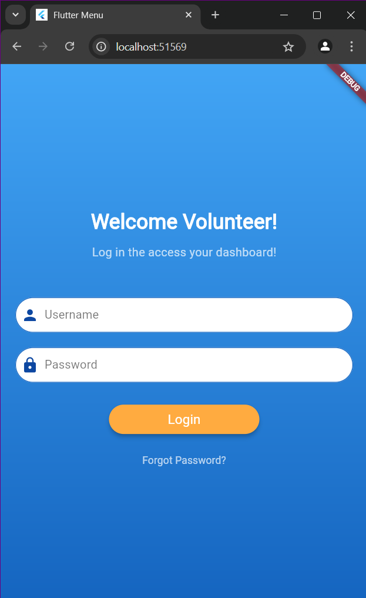
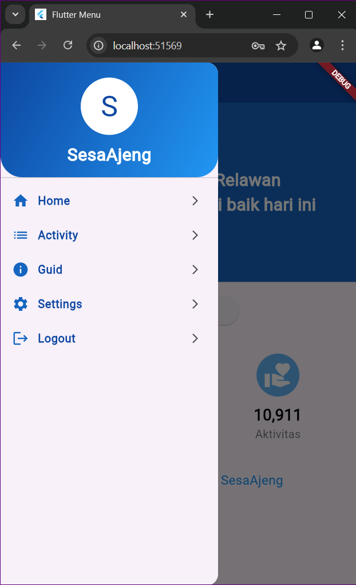
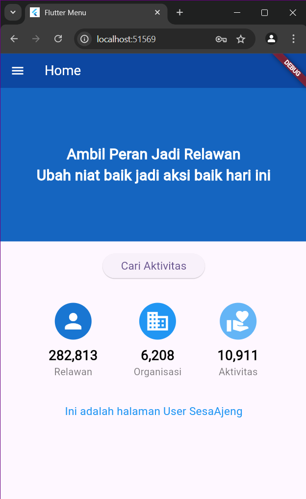
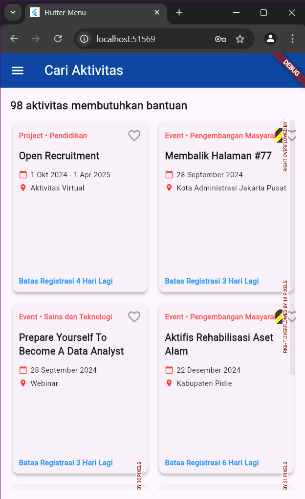
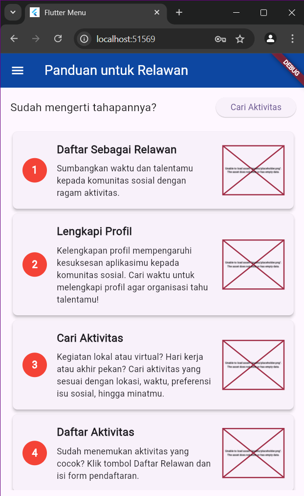
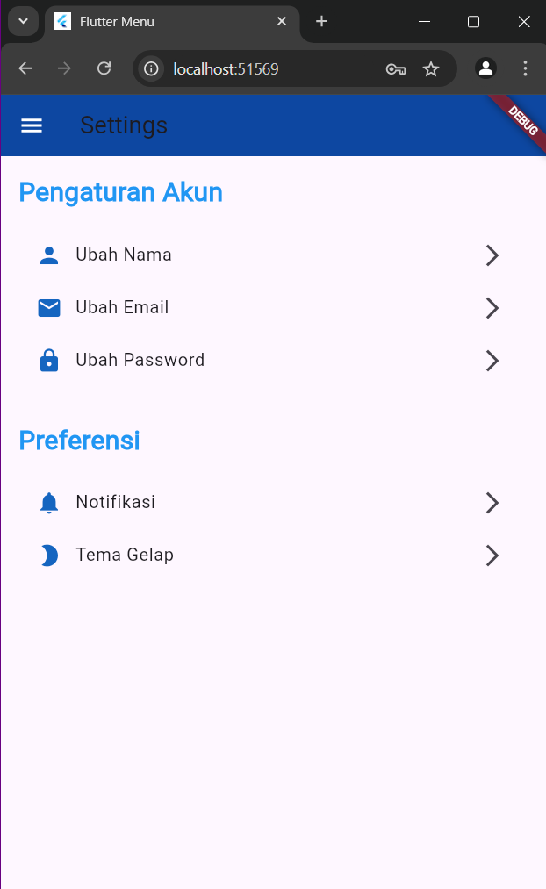
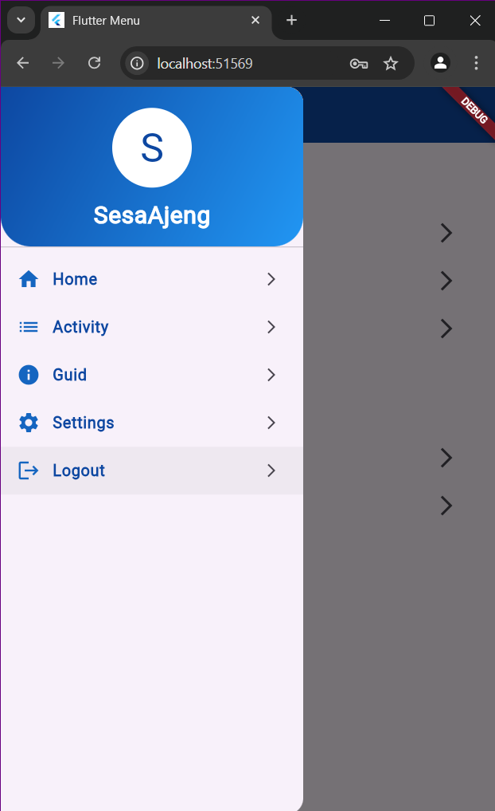

# pertemuan3_aplikasi
1. Import Statements
dart
Salin kode
import 'package:flutter/material.dart';
import 'package:pertemuan3_aplikasi/home_page.dart';
import 'package:pertemuan3_aplikasi/login_page.dart';
import 'package:pertemuan3_aplikasi/activity_page.dart';
import 'package:pertemuan3_aplikasi/guid_page.dart';
import 'package:pertemuan3_aplikasi/settings_page.dart';
import 'package:shared_preferences/shared_preferences.dart';
Kode ini mengimpor berbagai pustaka dan file yang diperlukan, termasuk pustaka material dari Flutter dan file lain untuk halaman yang akan digunakan dalam aplikasi. shared_preferences digunakan untuk menyimpan dan mengambil data sederhana seperti nama pengguna.
2. Class Sidemenu
dart
Salin kode
class Sidemenu extends StatelessWidget {
  const Sidemenu({Key? key}) : super(key: key);
Kelas Sidemenu merupakan subclass dari StatelessWidget, yang berarti bahwa widget ini tidak memiliki keadaan yang dapat berubah (state). Ini adalah menu samping yang akan ditampilkan di aplikasi.
3. Loading Username
dart
Salin kode
Future<String> _loadUsername() async {
  SharedPreferences prefs = await SharedPreferences.getInstance();
  return prefs.getString('username') ?? 'Guest';
}
Fungsi _loadUsername ini menggunakan SharedPreferences untuk mengambil nama pengguna yang telah disimpan. Jika tidak ada nama pengguna yang ditemukan, akan mengembalikan 'Guest'.
4. Building the Widget
dart
Salin kode
@override
Widget build(BuildContext context) {
  return Drawer(
    child: FutureBuilder<String>(
      future: _loadUsername(),
      builder: (BuildContext context, AsyncSnapshot<String> snapshot) {
        // Handle loading and error states
        ...
      },
    ),
  );
}
Metode build menghasilkan widget Drawer, yang merupakan menu samping yang dapat digeser. FutureBuilder digunakan untuk membangun tampilan berdasarkan status dari operasi asynchronous (_loadUsername).
FutureBuilder akan menampilkan indikator loading saat nama pengguna sedang dimuat. Jika terjadi kesalahan, akan menampilkan pesan kesalahan.
5. DrawerHeader
dart
Salin kode
DrawerHeader(
  decoration: BoxDecoration(
    gradient: LinearGradient(
      colors: [Colors.blue[900]!, Colors.blue[500]!],
      begin: Alignment.topLeft,
      end: Alignment.bottomRight,
    ),
    borderRadius: BorderRadius.only(
      bottomLeft: Radius.circular(30),
      bottomRight: Radius.circular(30),
    ),
  ),
  child: Column(
    mainAxisAlignment: MainAxisAlignment.center,
    children: [
      CircleAvatar(
        radius: 40,
        backgroundColor: Colors.white,
        child: Text(
          username[0].toUpperCase(),
          style: TextStyle(fontSize: 40, color: Colors.blue[900]),
        ),
      ),
      const SizedBox(height: 10),
      Text(
        username,
        style: const TextStyle(
          color: Colors.white,
          fontSize: 24,
          fontWeight: FontWeight.bold,
        ),
      ),
    ],
  ),
),
Bagian ini mendesain header untuk menu samping dengan gradien warna biru. Header ini menampilkan inisial nama pengguna dalam CircleAvatar dan nama pengguna itu sendiri di bawahnya.
6. ListTile Items
dart
Salin kode
_buildListTile(
  context,
  title: 'Home',
  icon: Icons.home,
  onTap: () {
    Navigator.pushReplacement(
      context,
      MaterialPageRoute(builder: (context) => const HomePage()),
    );
  },
),
Menggunakan fungsi _buildListTile untuk membuat elemen daftar dalam menu. Setiap elemen daftar (ListTile) memiliki judul, ikon, dan tindakan (onTap) yang menavigasi pengguna ke halaman terkait.
Fungsi Navigator.pushReplacement digunakan untuk mengganti halaman saat ini dengan halaman baru.
7. Widget _buildListTile
dart
Salin kode
Widget _buildListTile(
  BuildContext context, {
    required String title,
    required IconData icon,
    required VoidCallback onTap,
  }) {
  return ListTile(
    leading: Icon(
      icon,
      color: Colors.blue[800],
    ),
    title: Text(
      title,
      style: TextStyle(
        color: Colors.blue[900],
        fontSize: 16,
        fontWeight: FontWeight.w600,
      ),
    ),
    onTap: onTap,
    trailing: const Icon(Icons.arrow_forward_ios, size: 16),
  );
}
Fungsi ini menghasilkan widget ListTile dengan ikon di sebelah kiri, judul di tengah, dan ikon panah di sebelah kanan untuk menunjukkan bahwa item tersebut dapat diklik. Fungsi ini juga memformat warna dan ukuran teks.

## Screenshot

